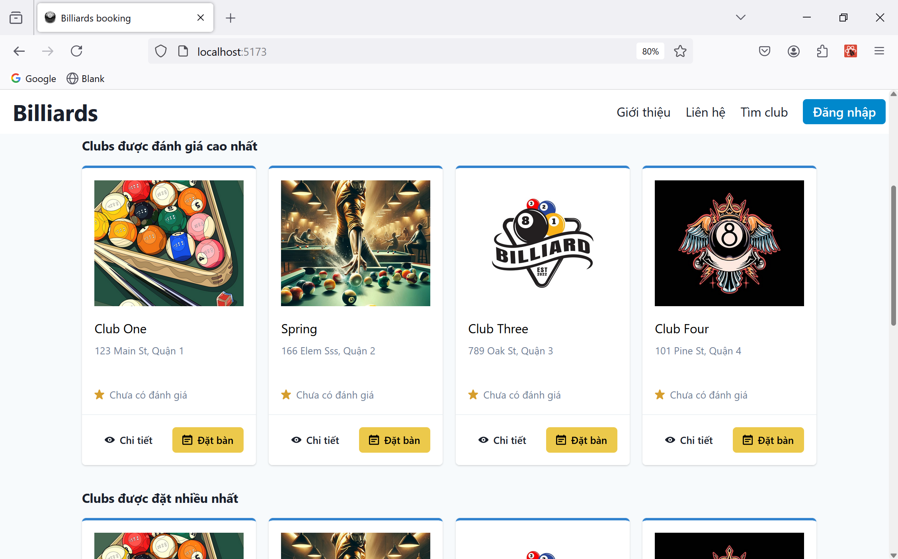
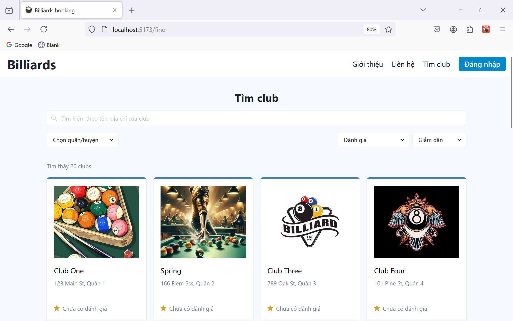
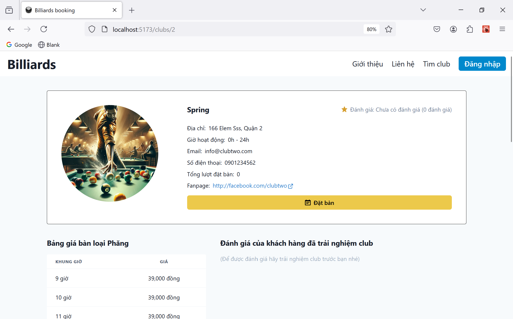
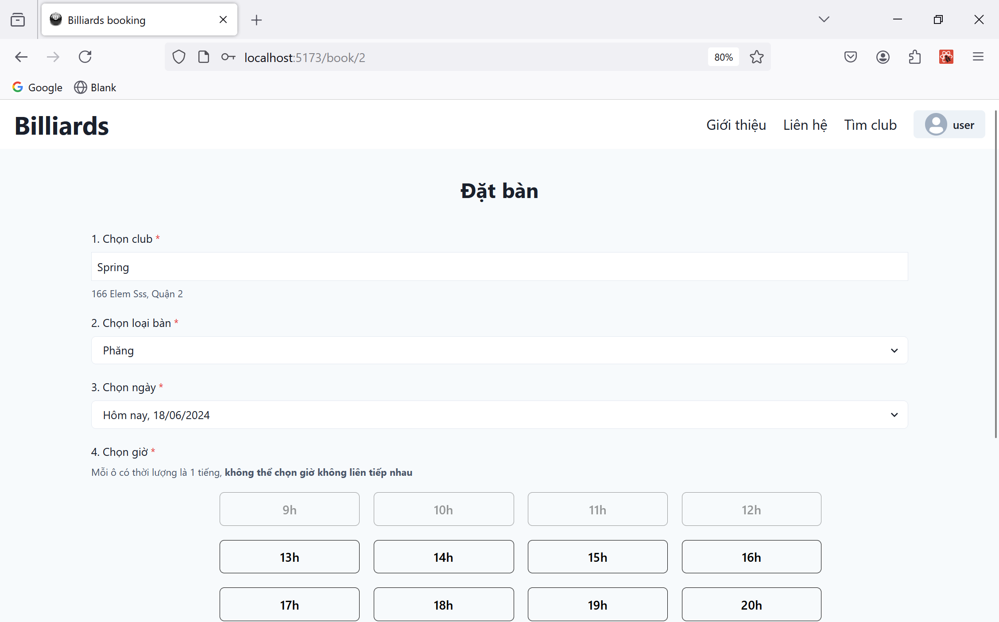
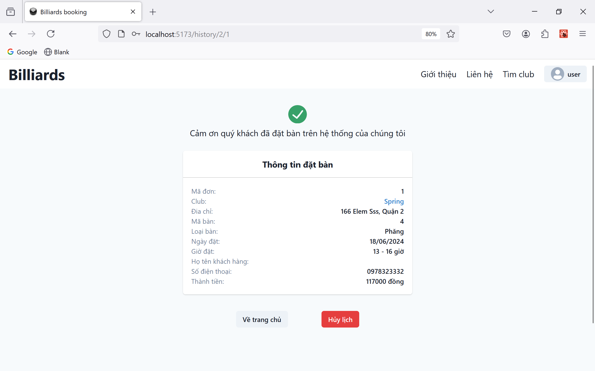

# Billiard Table Booking Platform

## Getting Started

To get started with this project, follow these steps:

### Prerequisites

- [Java Development Kit (JDK)](https://www.oracle.com/java/technologies/javase-jdk11-downloads.html)
- [Node.js and npm](https://nodejs.org/)
- [Spring Boot](https://spring.io/projects/spring-boot)
- [React](https://reactjs.org/)
- [Vite](https://vitejs.dev/)
- [Git](https://git-scm.com/)

### Installation

1. Clone the repository:

   ```bash
   git clone https://github.com/votrongluan/billiards-booking-webapp
   ```

2. Navigate to the backend folder and install dependencies:

   ```bash
   cd BBP_Backend
   mvnw clean install
   ```

3. Navigate to the frontend folder and install dependencies:
   ```bash
   cd ../BBP_Frontend
   npm install
   ```

### Setting Up the Database

1. Update the `application.properties` file in `BBP_Backend/src/main/resources` with your database connection string:

   ```properties
   spring.datasource.url=jdbc:mysql://localhost:3306/yourdatabase
   spring.datasource.username=yourusername
   spring.datasource.password=yourpassword
   ```

   **Please do not commit any changes in `application.properties`**

2. Run the `DatabaseScript.sql` in the `database` folder to set up the initial database schema.

## Usage

### Running the Application

1. Run the backend application:

   ```bash
   cd BBP_Backend
   mvnw spring-boot:run
   ```

2. Run the frontend application:

   ```bash
   cd ../BBP_Frontend
   npm run dev
   ```

3. Navigate to `http://localhost:5173` in your web browser to see the application in action.

### Examples

Here are some example usages of the application:

- View all clubs
- Book a table
- View your booking history

## Collaborate with Your Team

To collaborate within the team without forking, follow these steps:

### Branching Strategy

We use a Git branching strategy with three main branches:

- `master`: Contains the stable version of the code. Direct commits to this branch are restricted.
- `dev`: Contains the latest development changes. This is the main branch for ongoing development.
- `test`: Contains code that is under testing before being merged into `dev`.

### Working on a Feature

1. Create a new branch from `dev` for your feature:

   ```bash
   git checkout dev
   git pull origin dev
   git checkout -b feature/your-feature-name
   ```

2. Make your changes and commit them:

   ```bash
   git add .
   git commit -m 'Add some feature'
   ```

3. Push your branch to the repository:

   ```bash
   git push origin feature/your-feature-name
   ```

4. Create a pull request (PR) from your feature branch to `test` for testing:

   - Ensure all tests pass before requesting a merge.
   - Team members review and approve the PR.
   - Once approved, the PR is merged into `test`.

5. After thorough testing, create a pull request from `test` to `dev`.

6. For releases, create a pull request from `dev` to `master`.

### Inviting Collaborators

- Go to your repository on GitHub.
- Click on `Settings`.
- Select `Manage Access`.
- Click `Invite a collaborator` and add the GitHub usernames of your team members.

## Test and Deploy

Use built-in continuous integration and continuous deployment (CI/CD) pipelines in GitHub Actions.

- Get started with GitHub Actions.
- Analyze your code for vulnerabilities with Static Application Security Testing (SAST).
- Deploy to your preferred cloud service.

## Support

If you need help, you can reach out via:

- [Issue Tracker](https://github.com/votrongluan/badminton-booking-razor-page/issues)
- [Email](mailto:support@razorpage.com)

## Screenshot

<div style="text-align: center;">
    
    <p><em>Home</em></p>
</div>

<hr/>
<br/>

<div style="text-align: center;">
    
    <p><em>Find club</em></p>
</div>

<hr/>
<br/>

<div style="text-align: center;">
    
    <p><em>Club detail</em></p>
</div>

<hr/>
<br/>

<div style="text-align: center;">
    
    <p><em>Book</em></p>
</div>

<hr/>
<br/>

<div style="text-align: center;">
    
    <p><em>Book detail</em></p>
</div>

<hr/>
<br/>

## Contributing

We welcome contributions! To contribute:

1. Fork the repository.
2. Create a new branch: `git checkout -b feature/your-feature-name`
3. Make your changes and commit them: `git commit -m 'Add some feature'`
4. Push to the branch: `git push origin feature/your-feature-name`
5. Open a pull request.

## Authors and Acknowledgment

Thanks to all the contributors who have helped develop this project.

## License

This project is licensed under the MIT License - see the [LICENSE](LICENSE) file for details.

## Project Status

This project is actively maintained. If you would like to contribute, please feel free to fork the repository and submit a pull request.
